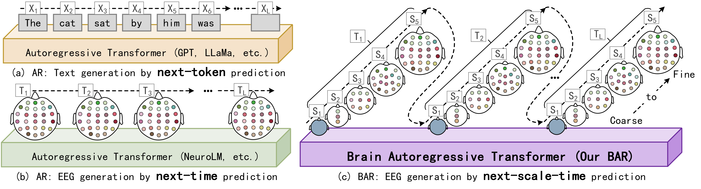

# THD-BAR: Topology Hierarchical Derived Brain Autoregressive Modeling for EEG Generic Representations

This repository is the official implementation of THD-BAR. 



## Abstract
Large-scale pre-trained models hold significant potential for learning universal EEG representations. However, most existing methods, particularly autoregressive (AR) frameworks, primarily rely on straightforward temporal sequencing of multi-channel EEG data, which fails to capture the rich physiological characteristics inherent to EEG signals. Moreover, their time-centered modeling approach also limits the effective representation of the dynamic spatial topology of brain activity. To address these challenges and fully exploit the potential of large-scale EEG models, we propose a novel Topology Hierarchical Derived Brain Autoregressive Modeling (THD-BAR) for EEG generic representations. The core innovation of THD-BAR lies in the introduction of the Brain Topology Hierarchy (BTH), which establishes a multi-scale spatial order for EEG channels. This hierarchical structure enables a redefinition of autoregressive learning as a "next-scale-time prediction" problem, effectively capturing both spatial and temporal dynamics. Based on BTH, we design a Topology-Hierarchical Vector Quantized-Variational Autoencoder (THVQ-VAE) for multi-scale tokenization and develop an enhanced Brain Autoregressive (BAR) module with specialized masking strategies for prediction. Through extensive large-scale pre-training on 17 datasets, followed by rigorous validation on 10 downstream datasets spanning 5 distinct tasks, THD-BAR consistently outperforms existing methods. These results highlight the superior generalization and modeling capabilities of our proposed approach.

## Environment Set Up

To install requirements:

```bash
conda create -n BAR python=3.12
conda activate BAR
pip install -r requirements.txt
```

## Run Experiments


1. **Stage 1: Neural Tokenizer Training**

   Train the THVQ-VAE to convert EEG data into hierarchical tokens.

   ```bash
   sh scripts/sh_train_thvq.sh
   ```

2. **Stage 2: BAR Pre-training**

   Pre-train the Brain Autoregressive (BAR) model using the tokens from the frozen THVQ-VAE, employing "next-scale-time prediction".

   ```bash
   sh scripts/sh_train_pretrain.sh
   ```

3. **Stage 3: Fine-tuning**

   Fine-tune the pre-trained BAR model on specific downstream EEG tasks using instruction-based learning.

   ```bash
   sh scripts/sh_train_instruction.sh
   ```

